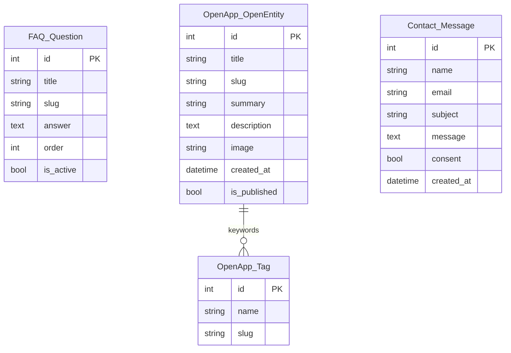

```mermaid
erDiagram
  FAQ_Question {
    int id PK
    string title
    string slug
    text answer
    int order
    bool is_active
  }

  OpenApp_Tag {
    int id PK
    string name
    string slug
  }

  OpenApp_OpenEntity {
    int id PK
    string title
    string slug
    string summary
    text description
    string image
    datetime created_at
    bool is_published
  }

  Contact_Message {
    int id PK
    string name
    string email
    string subject
    text message
    bool consent
    datetime created_at
  }

  OpenApp_OpenEntity ||--o{ OpenApp_Tag : keywords
```

Notas:
- `OpenEntity.keywords` es ManyToMany hacia `Tag`.
- `Question` controla el orden por `order`.
- `ContactMessage` solo lo crea el form público.

